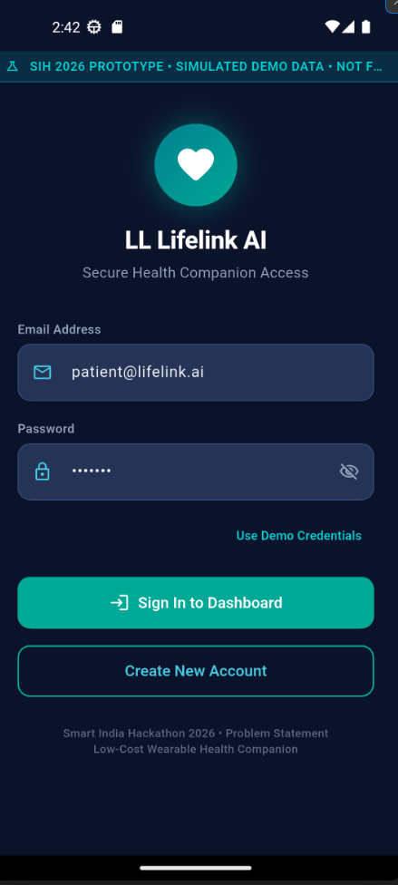
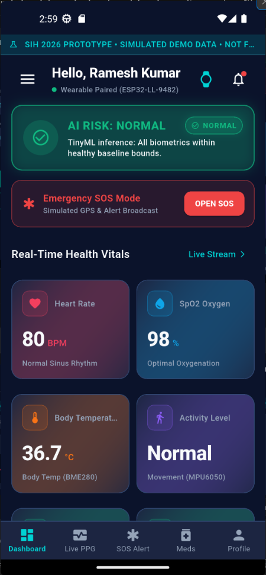
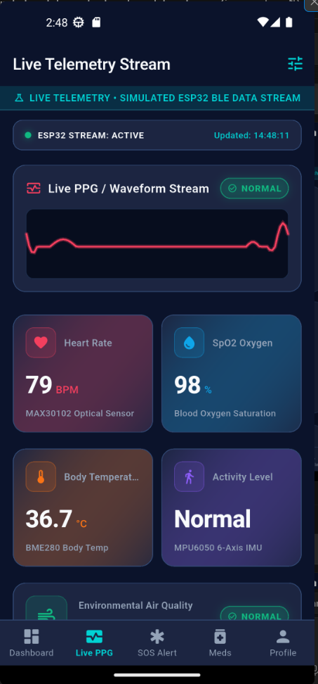
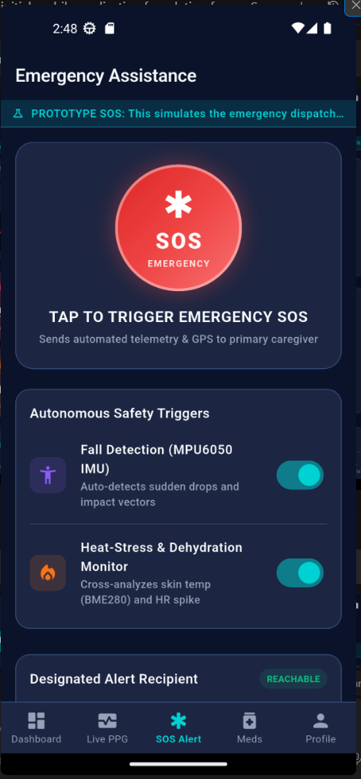
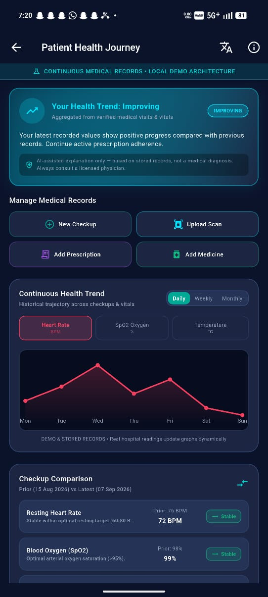
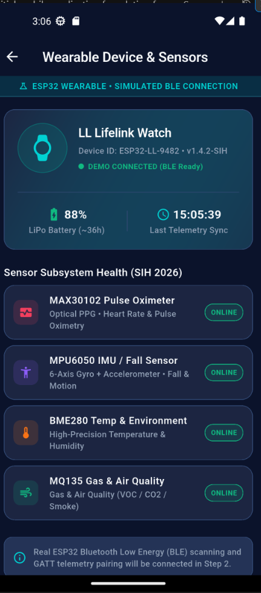
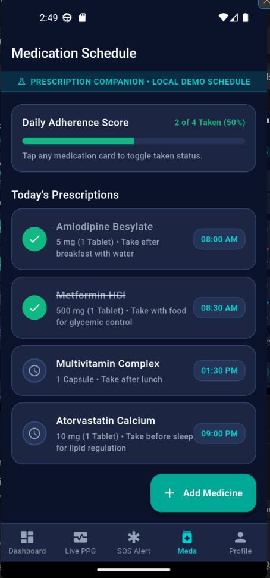
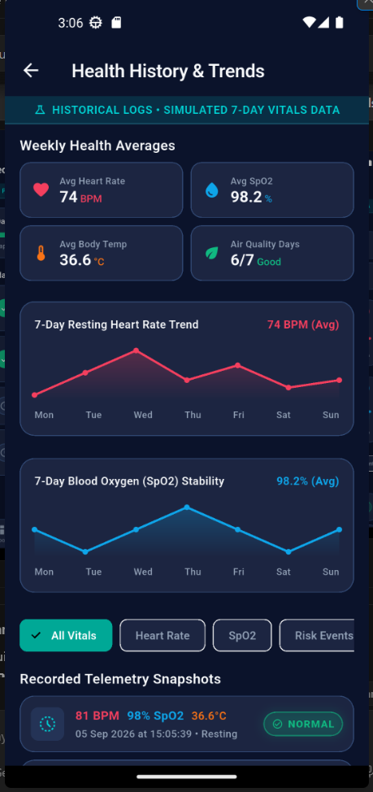
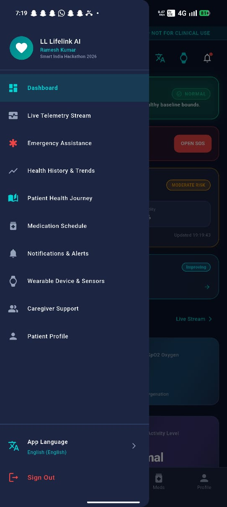
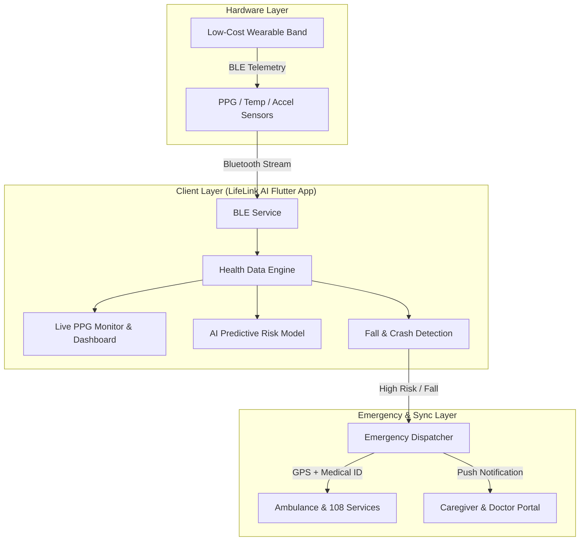

<div align="center">

# 🩺 LifeLink AI (LL)
### **Smart, Low-Cost Wearable & AI Healthcare Companion**
*Built for Smart India Hackathon 2026*

[](https://flutter.dev)
[](https://dart.dev)
[](https://sih.gov.in)
[](https://flutter.dev)
[](LICENSE)

<p align="center">
  <b>LifeLink AI</b> is an accessible, AI-powered healthcare ecosystem that pairs with low-cost wearable hardware to deliver <b>real-time continuous vitals monitoring</b>, <b>automated fall/crash detection</b>, <b>instant emergency SOS dispatch</b>, and <b>caregiver synchronization</b>.
</p>

[Key Features](#-key-features) •
[UI Showcase](#-ui-showcase) •
[System Architecture](#-system-architecture) •
[Project Structure](#-project-structure) •
[Getting Started](#-getting-started) •
[SIH 2026 Impact](#-smart-india-hackathon-2026-alignment)

---

</div>

## 📌 Executive Summary

Timely medical intervention saves lives. However, current advanced health monitoring wearables are prohibitively expensive for millions in rural and low-income areas. Furthermore, isolated emergency alerts often fail to transmit vital patient context to responders and caregivers.

**LifeLink AI** bridges this gap:
- **Low-Cost Wearable Integration**: Pairs over Bluetooth Low Energy (BLE) with affordable custom sensor bands (PPG, temperature, accelerometer).
- **Proactive AI Companion**: Analyzes vital telemetry trends in real time to detect anomalies before they become critical.
- **Fail-Safe Emergency Dispatch**: Automated crash/fall detection and instant 1-tap SOS that broadcasts GPS coordinates, medical history, and vital signs to emergency responders (108) and designated caregivers.
- **Multilingual Healthcare for India**: Fully localized into 8+ Indian regional languages to eliminate literacy and linguistic barriers.

---

## 📱 UI Showcase <a id="ui-showcase"></a>
### *Complete 9-Screen System Walkthrough & Analysis*

<div align="center">

| 1. Secure Authentication | 2. Real-Time Vitals Dashboard | 3. Live PPG Telemetry Stream |
|:---:|:---:|:---:|
|  |  |  |
| *Biometric & credential login with SIH prototype credentials* | *Live vitals overview, TinyML risk score & rapid SOS trigger* | *Real-time 60Hz pulse waveform & BLE telemetry data stream* |

<br />

| 4. Emergency Assistance (SOS) | 5. Patient Health Journey | 6. Wearable Device & Sensors |
|:---:|:---:|:---:|
|  |  |  |
| *Hold-to-trigger SOS dispatch & autonomous fall/impact detection* | *Aggregated health trajectory, checkup history & medical scans* | *ESP32 BLE peripheral sync & real-time sensor array diagnostics* |

<br />

| 7. Medication Schedule & Tracker | 8. Health History & Trends | 9. Navigation & Multilingual Support |
|:---:|:---:|:---:|
|  |  |  |
| *Daily adherence scoring & categorized dosage schedule* | *7-day resting heart rate & SpO2 stability analytics* | *Access to all clinical modules with 8+ regional Indian languages* |

</div>

---

## ✨ Key Features

### 1. 💓 Continuous Vitals Telemetry
- **Heart Rate & PPG Waveform**: Continuous pulse waveform monitoring at 60Hz.
- **Blood Oxygen (SpO2)**: Live saturation tracking with hypoxia alerts.
- **Core Body Temperature & Blood Pressure**: Estimates systolic/diastolic trends.
- **Environmental Telemetry**: Live ambient temperature and Air Quality Index (AQI) monitoring.

### 2. 🚨 Autonomous Emergency SOS & Fall Detection
- **1-Tap Hold-to-Trigger SOS**: Prevents accidental triggers while providing swift access in emergencies.
- **Accelerometer-Based Fall & Crash Detection**: Automatically triggers a countdown siren if an abrupt impact or unresponsiveness is detected.
- **Instant Location & Vital Dispatch**: Relays exact GPS coordinates, blood group, allergies, and last-known vitals to ambulances and emergency contacts.

### 3. 🧠 AI Health Companion & Risk Assessment
- **Predictive Risk Scoring**: Classifies health risk status into `Normal`, `Warning`, and `Emergency`.
- **Chronological Health Journey**: Logs resting heart rate trends, arrhythmia instances, and daily physical milestones.
- **Medical ID Badge**: Digital emergency card storing blood group, medical history, and physician notes.

### 4. 💊 Smart Medication & Prescription Manager
- **Categorized Dosages**: Morning, Afternoon, and Night schedules with clear meal-time instructions.
- **Adherence Score**: Visual daily completion tracker encouraging compliance.
- **Push Reminders**: Timely alerts so patients never miss life-saving doses.

### 5. 👨‍⚕️ Caregiver & Family Network
- **Remote Tele-Monitoring**: Family members and doctors can check in on the patient's live status anytime.
- **Shared Alerts**: Immediate notification broadcast if abnormal readings are recorded.

### 6. 🌐 Multilingual Accessibility
Built with first-class localization supporting 8+ languages:
- **English**
- **हिन्दी (Hindi)**
- **தமிழ் (Tamil)**
- **తెలుగు (Telugu)**
- **ಕನ್ನಡ (Kannada)**
- **മലയാളം (Malayalam)**
- **বাংলা (Bengali)**
- **मराठी (Marathi)**

---

## 🏗️ System Architecture



---

## 📂 Project Structure

```text
lib/
├── core/
│   ├── constants/            # Brand colors, typography, layout dimensions
│   ├── localization/         # 8+ Indian regional translation bundles
│   ├── theme/                # Custom Material 3 Dark theme design system
│   └── utils/                # Date, time, vital formatters
├── models/
│   ├── caregiver_model.dart  # Caregiver contact & access entity
│   ├── emergency_event_model.dart # SOS trigger & dispatch schema
│   ├── health_reading_model.dart  # Heart rate, SpO2, temp data models
│   ├── medication_model.dart      # Dosage & schedule schema
│   └── user_model.dart            # Patient profile & medical history
├── screens/
│   ├── auth/                 # Sign In & Registration flows
│   ├── caregiver/            # Remote family & doctor dashboard
│   ├── dashboard/            # Central vital monitoring hub
│   ├── emergency/            # SOS alarm, GPS coordinates & siren
│   ├── health_journey/       # AI health timeline & milestone history
│   ├── live_monitoring/      # Live PPG oscilloscope wave monitor
│   ├── medication/           # Daily medicine schedules & trackers
│   ├── navigation/           # Main shell & multi-screen drawer
│   └── wearable/             # BLE scanner, pairing & sensor calibration
├── services/
│   ├── auth_service.dart     # Authentication & user state
│   ├── emergency_service.dart# SOS triggers & dispatch simulation
│   ├── health_data_service.dart # Real-time sensor streaming & mock telemetry
│   └── localization_service.dart# Language switcher & persistence
└── widgets/
    ├── live_pulse_chart.dart # Real-time animated PPG oscilloscope graph
    ├── metric_card.dart      # Standardized vital statistics card
    ├── risk_badge.dart       # Dynamic Normal/Warning/Emergency badge
    └── sos_button.dart       # Hold-to-activate emergency SOS widget
```

---

## 🚀 Getting Started

### Prerequisites
- [Flutter SDK](https://docs.flutter.dev/get-started/install) (`>= 3.0.0`)
- [Dart SDK](https://dart.dev/get-dart) (`>= 3.0.0 < 4.0.0`)
- Android Studio / Xcode / VS Code with Flutter extensions
- Physical device or Emulator with Bluetooth / Web capabilities

### Installation & Run

1. **Clone the Repository**:
   ```bash
   git clone https://github.com/<your-username>/ll_lifelink_ai.git
   cd ll_lifelink_ai
   ```

2. **Install Dependencies**:
   ```bash
   flutter pub get
   ```

3. **Run the Application**:
   - **Android / iOS**:
     ```bash
     flutter run
     ```
   - **Chrome / Web**:
     ```bash
     flutter run -d chrome
     ```

4. **Run Unit & Widget Tests**:
   ```bash
   flutter test
   ```

---

## 🎯 Smart India Hackathon 2026 Alignment

| Criteria | LifeLink AI Implementation |
|---|---|
| **Affordability** | Designed to integrate with sub-₹1000 ($12) IoT sensor hardware, making continuous vital tracking viable for underprivileged populations. |
| **Emergency Response** | Reduces the golden-hour emergency response time by transmitting instant geo-coordinates and real-time medical ID. |
| **Inclusivity** | Native regional language support (Hindi, Tamil, Telugu, Kannada, etc.) ensures zero barrier to entry for non-English speakers. |
| **Caregiver Trust** | Empowers distant family members with peace-of-mind telemetry alerts and real-time risk indicators. |

---

## 📄 License

This project is licensed under the MIT License — see the [LICENSE](LICENSE) file for details.

<div align="center">
  <sub>Developed with ❤️ for <b>Smart India Hackathon 2026</b></sub>
</div>
